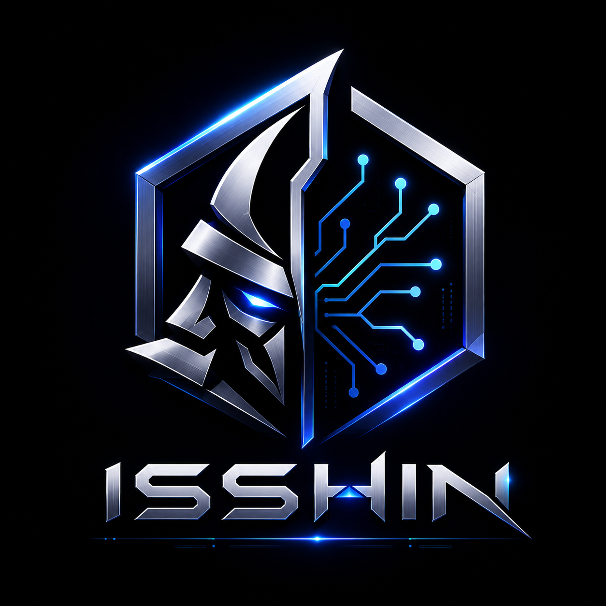

<p align="center">
  
</p>

# Isshin Player

A minimal iOS video player for personal use. Import videos from the Photos library, manage a playlist, and play with standard controls — including playback speed, Picture-in-Picture, and background audio.

**Stack:** SwiftUI · AVFoundation · PhotosUI · iOS 17+

---

## Requirements

- macOS with **full Xcode** (Command Line Tools alone are not enough)
- Free Apple ID for signing (App Store distribution not required)

## Open & Run

```bash
open IsshinPlayer.xcodeproj
```

1. Select the **IsshinPlayer** target → **Signing & Capabilities**
2. Choose your **Personal Team** (free Apple ID)
3. Pick a simulator or a paired iPhone → **⌘R**

### First install on a physical device

1. Connect the iPhone with a cable once (required for the initial pairing; wireless debugging works afterward if enabled)
2. Trust the computer on the device
3. After install, if needed: **Settings → General → VPN & Device Management** → trust your developer certificate
4. Free provisioning profiles expire about every **7 days** — reconnect and **⌘R** to refresh

Keep the Simulator open between runs; do not quit it every time. Use **⌘R** to rebuild and relaunch.

---

## Features

| Feature | Notes |
|--------|--------|
| Import from Photos | Multi-select videos into a playlist |
| Playback | Play / pause, scrubbable progress |
| Speed | 0.5x – 2x (persists across track changes) |
| Playlist | Switch, delete (context menu), auto-advance |
| Picture-in-Picture | When the system allows it (often limited on Simulator — use a real device) |
| Background audio | Continues on lock screen / Home; Control Center remote commands |
| UI | Fixed dark theme, in-player overlay controls |

---

## Project layout

```
IsshinPlayer/
├── App/                 # App entry
├── Core/
│   ├── Theme/           # Dark palette
│   ├── Audio/           # Session + Now Playing / remote commands
│   └── PiP/             # Picture-in-Picture
├── Features/Player/     # Player UI, view model, playlist, import
├── DesignSystem/        # Empty / loading / error / brand logo
├── Assets.xcassets/
└── Info.plist           # Photo usage + audio background mode
```

Optional: `project.yml` (XcodeGen)

---

## Notes

- Personal / sideload only — not configured for App Store release
- `.cursor/` is gitignored (local editor config)
